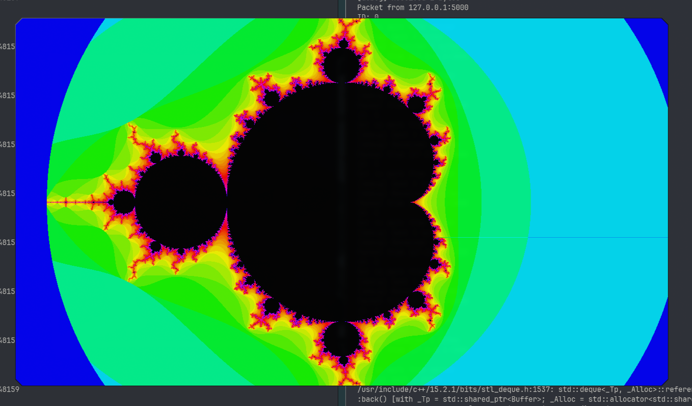

# Mandelbrot Set Distributed Renderer

A C++ Mandelbrot renderer built as a small distributed system.

The project has two executables:
- `server`: opens an SDL window, creates render jobs, and collects computed pixels.
- `client`: requests jobs from the server, computes Mandelbrot pixels, and sends results back.

## Screenshot



## Why This Project

This project demonstrates:
- fractal rendering (Mandelbrot set)
- parallel/distributed work over UDP
- basic real-time visualization with SDL

It is a practical combination of math, networking, and systems programming in modern C++.

## Features

- Distributed rendering with multiple clients
- Interactive camera movement and zoom
- Adjustable iteration depth
- Optional anti-aliasing toggle
- CMake-based build workflow

## Architecture

The renderer uses a job-based flow:

- The server splits the image into horizontal chunks
- Clients ask for work via UDP
- Clients compute pixel colors for their chunk
- Clients send finished pixels back to the server
- The server updates the SDL surface incrementally

## Detailed Documentation

For a complete deep dive (German), see:

- `docs/README.md` (documentation index)
- `docs/DEEP_DIVE_DE.md` (architecture, data flow, thread model, Mandelbrot math, code mapping)
- `docs/PROTOKOLL_DE.md` (exact UDP packet layouts and protocol behavior)
- `docs/CODE_MAP_DE.md` (function-by-function reference of the codebase)

## Tech Stack

- C++14
- Boost.Asio (UDP networking)
- SDL 1.2 API (`sdl12-compat` on Arch Linux)
- CMake + Make

## Getting Started

### Prerequisites

Arch Linux:

```bash
sudo pacman -S --needed base-devel cmake boost sdl12-compat
```

Ubuntu/Debian (equivalent packages):

```bash
sudo apt update
sudo apt install -y build-essential cmake libboost-all-dev libsdl1.2-dev
```

### Build

Recommended:

```bash
make build
```

Alternative with presets:

```bash
cmake --preset debug
cmake --build --preset debug -j
```

## Running the Application

Start the server first:

```bash
make run-server WIDTH=1280 HEIGHT=720 PORT=5000
```

Start one or more clients in separate terminals:

```bash
make run-client HOST=127.0.0.1 PORT=5000
```

Direct binary execution:

```bash
./build/debug/server 1280 720 5000
./build/debug/client 127.0.0.1 5000
```

## Controls (Server Window)

- Arrow keys: move viewport
- `PageUp` or `m`: zoom in
- `PageDown` or `p`: zoom out
- `+`: increase max iterations
- `-`: decrease max iterations
- `Return` or `q`: toggle anti-aliasing
- `Esc`: exit

## Project Structure

- `src/server/` server entry point and UDP server implementation
- `src/client/` client entry point and UDP client implementation
- `include/shared/` shared networking/buffer definitions
- `include/server/` server headers
- `include/client/` client headers
- `CMakeLists.txt` build targets
- `Makefile` convenience commands

## Troubleshooting

- `cmake: command not found`  
Install CMake using your package manager.
- SDL not found on Arch  
Install `sdl12-compat`.
- Client appears idle  
Ensure the server is already running and `HOST`/`PORT` match.

## Known Limitations

- UDP is unreliable by design (packet loss is possible).
- No authentication/encryption in network communication.
- Rendering protocol is simple and intended for local/trusted environments.
